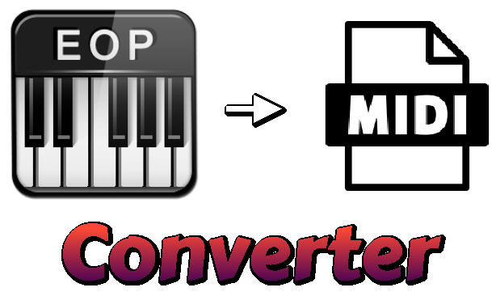

  
  
  # EOP to MIDI Converter
  **A EveryonePiano file format converter back to MIDI**

This program is made only to convert EveryonePiano recordings and also some existings demos to MIDI, this is also suitable for soundfont recreations and music reverse engineer for EveryonePiano's music format.
## How I use this program?
Just drag your EOP file made with EveryonePiano, then drag the file into the Python file and done. Your file is now converted. This program is made to help people who want MIDI instead of paying bucks all the time.
## AI disclosure
This program's language is Python, it is made with help of ChatGPT. The assets are still my own.
